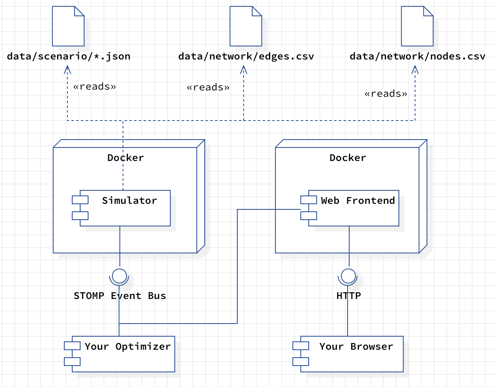

This document describes the software architecture of the ride hailing simulation, the configuration
possibilities, and how you can integrate your optimization idea.

# Architecture
## Integration View
The following depiction shows the deployment view of the `Simulation Framwork`. 



The `Simulation Framework` consists of two Docker containers. The first one contains the actual
`Simulator`. It reads several configuration files that describe the actual simulation *plan*. The
second container contains the `Web Frontend` you can open with your browser. It serves as a
graphical visualization of the simulation and gives you insights into current vehicles in the fleet,
travel requests, and metrics. The `Web Frontend` uses the [`STOMP Event Bus`](https://stomp.github.io)
to exchange information with the `Simulator`. This interface is also the connection to your `Optimizer`. 


## Configuration Files
The framework uses three input files that steer the actual simulation:

**data/network/*.csv** These files store all information on the road network that we operate on. You
find detailed descriptions of the file format [here](road-network.md).

**data/scenario/*.json** A series of events stored in a JSON file that describes 
the scenario to execute. Please click here for a detailed description of the 
[events](event-documentation.md).

## External Interfaces

**HTTP** You can connect to the simulation framework using a standard web 
browser. The web browser will show a simulation UI that displays the current
map, the location of the fleet, existing requests, and additional metrics. 

**STOMP** The STOMP-API allows your `Optimizer` to communicate with the 
simulation. You are getting updates on changes in the simulation state, new
requests, or any other stuff you have to know about. The
[Event Documentation](event-documentation.md) explains the events in greater
detail.

# Road Network

The road network is modelled as a **directed graph**, consisting of a set of nodes and a set of directed edges. 


Nodes represent road intersections or segment endpoints. Directed edges represent road segments between two nodes.
Two-way streets are stored as two separate directed edges. 

## Mapping to CSV
Node and edge data are saved in separate CSV files and modelled as follows:

Each node contains the following fields:

- `id` (long): Unique identifier for the node.
- `latitude` (double): Latitude in WGS84 (EPSG:4326).
- `longitude` (double): Longitude in WGS84 (EPSG:4326).

Each edge contains the following fields:

- `id` (long): Unique identifier for the edge.
- `start-node` (long): Source node ID (foreign key to node `id`).
- `end-node` (long): Target node ID (foreign key to node `id`).
- `length` (float): Length of the edge in meters.
- `maximum-speed` (int): Maximum speed (km/h) at which a vehicle can travel along this edge, assuming free-flow travel speeds.

In the CSV files, the column names contain with the corresponding data type to allow an easier parsing.

## Bremen Road Network

An example road network for the city of Bremen, Germany is provided in `data/networks/bremen`. 


- `nodes.csv` contains 22.242 nodes.
- `edges.csv` contains 52.868 directed edges.

The script used to download and save this data can be found at `src/scripts/get_bremen_map_data.py`.

# Events
In the following, we describe the structure and purpose of all existing events. The events are
serialized in JSON format, allowing you to write clients in any programming language. There are three
sources for events: the environment, the simulation, and the optimizer. Environmental events stem from
outside the simulation, such as transportation requests, traffic jams, or road closures. These events
are statically generated based on a scenario or dynamically by the user interface. Simulation events
are results of the actual simulation process, such as a vehicle passing an intersection (a node in the
graph) or a transportation request being fulfilled. The optimizer itself sends only events regarding
route planning and explanations. Other events will be filtered out by the simulation.

*Note:* We will often refer to events by using its short name `category:name`, e.g. `simulation:start`.

##  Simulation Lifecycle Events

### Start the Simulation (`simulation:start`)
```json
{
  "category": "simulation",
  "name": "start"
}
```

**Description**<br/>
Informs the Simulation that the simulation should be started.

**Senders**
* Optimizer
* Visualization

**Receivers**
* Simulation

**Response Events**
* `simulation:state`

**Attributes**
* **category**: Is always set to `"simulation"`.
* **name**: Is always set to `"start"`.

---

### Pause the Simulation (`simulation:pause`)
```json
{
  "category": "simulation",
  "name": "pause"
}
```

**Description**<br/>
Requests the simulation to pause its execution and informs all components about the paused state.

**Senders**
* Visualization

**Receivers**
* Optimizer
* Simulation
* Visualization

**Response Events**

* `simulation:state`
**Attributes**
* **category**: Is always set to `"simulation"`.
* **name**: Is always set to `"pause"`.


---

### Continue the Simulation (`simulation:continue`)
```json
{
  "category": "simulation",
  "name": "continue"
}
```

**Description**<br/>
Requests the simulation to resume execution after being paused.

**Senders**
* Visualization

**Receivers**
* Optimizer
* Simulation
* Visualization

**Response Events**
* `simulation:state`

**Attributes**
* **category**: Is always set to `"simulation"`.
* **name**: Is always set to `"continue"`.


---

### Stop the Simulation (`simulation:stop`)
```json
{
  "category": "simulation",
  "name": "stop"
}
```

**Description**<br/>
Requests the simulation to stop execution and informs all components about the termination.

**Senders**
* Optimizer
* Visualization

**Receivers**
* Optimizer
* Simulation
* Visualization

**Response Events**
* `simulation:state`

**Attributes**
* **category**: Is always set to `"simulation"`.
* **name**: Is always set to `"stop"`.


---

### Reset the Simulation (`simulation:reset`)
```json
{
  "category": "simulation",
  "name": "reset"
}
```

**Description**<br/>
Indicates that the simulation has been reset to its initial state. All components should discard their current state and prepare for a fresh run.

**Senders**
* Simulation

**Receivers**
* Optimizer
* Simulation
* Visualization

**Response Events**
* `simulation:state`

**Attributes**
* **category**: Is always set to `"simulation"`.
* **name**: Is always set to `"reset"`.

---

### Simulation State Update (`simulation:state`)
```json
{
  "category": "simulation",
  "name": "state",
  "state": string
}
```

**Description**<br/>
Broadcasts the current state of the simulation (e.g., STOPPED, INITIALIZING, RUNNING, PAUSED) to all components.

**Senders**
* Simulation

**Receivers**
* Optimizer
* Simulation
* Visualization

**Response Events**
* None

**Attributes**
* **category**: Is always set to `"simulation"`.
* **name**: Is always set to `"state"`.


---

### Initialize World (`simulation:initialize-world`)
```json
{
  "category": "simulation",
  "name": "initialize-world"
}
```

**Description**<br/>
Triggers the internal initialization of the simulation world, such as creating entities, environment setup, and initial conditions. This event is processed only within the Simulation component.

**Senders**
* Simulation

**Receivers**
* Simulation

**Response Events**
* None

**Attributes**
* **category**: Is always set to `"simulation"`.
* **name**: Is always set to `"initialize-world"`.


---

### Simulation Initialized (`simulation:initialize`)
```json
{
  "category": "simulation",
  "name": "initialize"
}
```

**Description**<br/>
Indicates that the simulation has completed its initialization phase and that external components,
such as the optimizer should initialize. The Simulation waits until a `client:initialized` event
is sent by every client.

**Senders**
* Simulation

**Receivers**
* Optimizer
* Simulation
* Visualization

**Response Events**
* `client:initialized`

**Attributes**
* **category**: Is always set to `"simulation"`.
* **name**: Is always set to `"initialize"`.


---

### Client Initialized (`client:initialized`)
```json
{
  "category": "client",
  "name": "initialized"
}
```

**Description**<br/>
Signals to the Simulation that a client component (Optimizer, Simulation, or Visualization) has
completed its initialization and is ready to participate.

**Senders**
* Optimizer
* Simulation
* Visualization

**Receivers**
* Simulation

**Response Events**
* None

**Attributes**
* **category**: Is always set to `"client"`.
* **name**: Is always set to `"initialized"`.