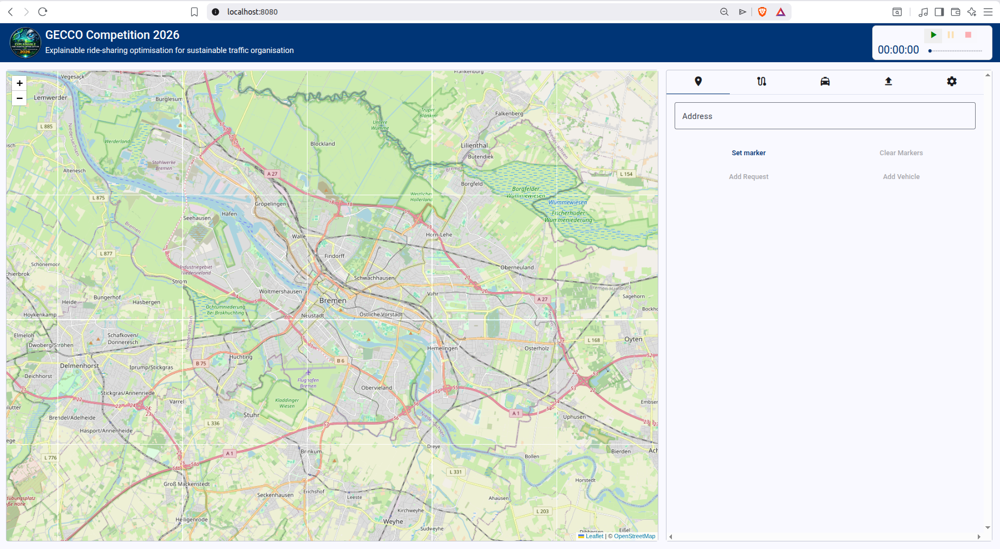

In this tutorial, we will walk through the key steps for building an optimizer for the ride-hailing challenge. We will implement a simple greedy optimizer in Java that connects to the simulation server, receives events, and responds with route proposals.

Our optimizer will maintain an internal representation of the road network and react to simulation events (such as vehicles becoming available or new ride requests arriving) by assigning each request to the closest available vehicle.
## Table of Contents 
-  [Getting Started](#getting-started)
- [Connecting to the Simulation](#connecting-to-the-simulation)
-  [Events](#events) 
- [Server Lifecycle Events](#server-lifecycle-initialization-and-reset)
- [The Road Network](#the-road-network)
- [Ride Requests](#ride-requests)
- [Vehicles](#vehicles)  
- [Planning a Route](#planning-a-route) 
-  [Optimization Strategy](#optimization-strategy) 

## Getting Started
Before implementing a client, we will need to be able to run the simulation (server) and UI (visualisation client). Source code for simulation and UI can be found in the [GECCO26-Competition](https://gitlab.informatik.uni-bremen.de/evoal/vehicle-routing-problem/gecco26-competition#) repository. 

### Startup
After downloading the source code, the simulation and the UI can be started via **Docker**. 

The Docker compose (`src/docker/compose`) allows you to start all the containers with the correct settings; however, you must change the location of the data folder to match the relative path to the data folder in the project. For example, to `../../java/simulator/data/:/data`.
```yaml
services:
  simulator:
    image: gitlab.informatik.uni-bremen.de:5005/evoal/vehicle-routing-problem/gecco26-competition/simulator:0.9.0
    ports:
      - 8088:8088
    restart: unless-stopped
    volumes:
      # attach a directory relative to the directory containing this compose file
      - <Set location to data folder>:/data
```
Now, you can carry out the following command:
```bash
docker compose up
```
You should be able to access the UI at `http://localhost:8080/`. 


### Tutorial Code (Greedy Optimizer)
For this tutorial, we will implement an optimizer in Java. Source code can be found in the [competition repository](https://gitlab.informatik.uni-bremen.de/evoal/vehicle-routing-problem/gecco26-competition); please feel encouraged to follow along in a programming language of your choice.

##  Connecting to the Simulation
STOMP (Simple Text Oriented Messaging Protocol) is a lightweight messaging protocol that runs over Websocket. It is how the client and simulator communicate. All Simulation and Optimizer events are exchanged as STOMP messages. 

### Connecting to the Server

On startup, the optimizer connects to the backend via a STOMP CONNECT message at: `ws://localhost:8088/simulation-websocket`

> **Important:** You must include the custom STOMP header `role: OPTIMIZER`. Without it, the server will reject the connection and won't know which events to forward to your client.

In our Spring Boot application, we use the `@PostConstruct` annotation on our `connect`-method to ensure that it runs automatically once the `StompSessionHandler` is initialized:

```java
@PostConstruct  
public void connect() {  
    final StompHeaders headers = new StompHeaders();  
    headers.add("role", "OPTIMIZER");  
 
    stompClient.connectAsync(  
        url,  // ws://localhost:8088/simulation-websocket
        new WebSocketHttpHeaders(),  
        headers,  
        this  
    );  
}
```
### Subscribing to the Events Topic
Once the STOMP session is established, the client subscribes to `/topic/simulation-events`. This is the broadcast destination where the server publishes simulation state updates to all connected subscribers.
```java
@Override  
public synchronized void afterConnected(StompSession session, @NonNull StompHeaders connectedHeaders) {  
    log.info("Connected to STOMP server");  
    log.info("Subscribing to /topic/simulation-events");  
  
    this.session = session;  
  
    session.subscribe("/topic/simulation-events", new StompFrameHandler() {  
        ...
    });  
}
``` 

Once this is set up properly, we can start our optimizer while the simulation is running. We expect to see a successful connect event as well as a subscription to the events topic:

```
INFO 194830 --- [greedy-optimizer] [           main] d.e.v.g.websocket.StompSessionHandler    : Connecting to ws://localhost:8088/simulation-websocket
INFO 194830 --- [greedy-optimizer] [ient-AsyncIO-17] d.e.v.g.websocket.StompSessionHandler    : Connected to STOMP server
INFO 194830 --- [greedy-optimizer] [ient-AsyncIO-17] d.e.v.g.websocket.StompSessionHandler    : Subscribing to /topic/simulation-events
```

### Receiving Messages
After the client has subscribed to the events topic, it can receive messages from the server. The client should decide what to do with an incoming message.

In our Java client, we override the following methods in `StompFrameHandler`. Now, when we receive a message from the simulation, it will be parsed as an `Event` and handed off to the `EventDispatcher`, which will be discussed in detail in the next section.
```java
@Override  
public @NonNull Type getPayloadType(@NonNull StompHeaders headers) {  
    return Event.class;  
}  
  
@Override  
public void handleFrame(@NonNull StompHeaders headers, Object payload) {  
    final Event event = (Event) payload;  
    final List<Event> responses = eventDispatcher.handleEvent(event);  
	responses.forEach(StompSessionHandler.this::send);
}
```


### Sending Messages 
To send a message to the server, the client publishes to the `/sim/events` destination. Along with the destination, the STOMP headers must include two additional fields identifying the event: 

| Header | Value | 
|---|---| 
|  `destination`  |  `/sim/events`  | 
|  `name`  |  `event.name`  | 
|  `category`  |  `event.category`  | 

The `send()` method below handles this, and guards against sending on a disconnected session: 
```java
private synchronized void send(final Event event) {  
    if (session == null || !session.isConnected()) {  
        return;  
    }  
    try {  
        final StompHeaders headers = new StompHeaders();
        headers.add("destination", "/sim/events");
        headers.add("name", event.name);
        headers.add("category", event.category);
        session.send(headers, event);  
    } catch (Exception e) {  
        log.error("Failed to send event {}", event, e);  
    }  
}
```


## Events

Communication between server and client is message-based, where each message describes an **event**. An event consists of three fields:

| Field | Type | Description |
|---|---|---|
| `category` | `String` | Component responsible for event |
| `name` | `String` | Specific event identifier |
| `data` | `Map<String, Object>` | Arbitrary event payload |

**A complete reference of all event types can be found [here](https://evoal.de/docs/competition26/architecture#events).**

The optimizer does not need to handle every event — only those relevant to the optimization logic, plus a set of housekeeping events for initializing and resetting the simulation. The optimizer can also *emit* its own events, such as route-planning instructions.

To manage this, we define an `EventDispatcher` that maps each event (uniquely identified by `category` + `name`) to a designated handler method. Now, when an event is received, `handleEvent` is called and the specified method is applied. 

```java
@Service  
public class EventDispatcher {  
  
  
    private final Map<EventKey, Function<Event, Optional<Event>>> eventHandlers = new HashMap<>();  
  
    public EventDispatcher(  
            final WorldManager world,  
            final GreedyOptimizer optimizer) {   
        //example handlers
        eventHandlers.put(new EventKey("simulation", "reset"), optimizer::onReset);  
        eventHandlers.put(new EventKey("simulation", "initialize"), this::respondWithStartSimulation);  
        eventHandlers.put(new EventKey("request", "ride-request-received"), optimizer::planRoute); 
        ...
    }  
  
  
	public List<Event> handleEvent(Event event) {  
	    final EventKey key = new EventKey(event.category, event.name);  
	    return eventHandlers.getOrDefault(key, (e) -> {  
	                return List.of();  
	            })  
	            .apply(event);  
	}
}
```

## Server Lifecycle: Initialization and Reset
The optimizer should handle (at least) two life-cycle events emitted by the server: `simulation:initialize` and `simulation:reset`.

**Initialization**

When `simulation:initialize` is received, the client must respond with a `client:initialized` event to signal that it is ready to begin:

```java
private List<Event> respondWithStartSimulation(final Event event) {  
    return List.of(new Event("client", "initialized"));  
}
```

**Reset**

When `simulation:reset` is received, the client should perform any necessary cleanup before the next run begins. In our implementation, this means clearing all cached map data, vehicles, and requests.


## The Road Network

A ride-hailing problem is situated within a road network consisting of **roads** (directed, weighted edges) and **intersections** (nodes). For a full explanation of the structure/format of the road network used in this challenge, see the [road network documentation](https://evoal.de/docs/competition26/architecture#road-network). 

In our client, we create a model `Road` class with the following fields:

| Field | Type | Description |
|---|---|---|
| `id` | `Long` | Unique identifier of Road. |
| `length` | `double` | Length of edge in meters. |
| `maxSpeed` | `int` | Maximum speed along edge in Km/h. |
| `properties` | `Map<String, Object>` | Road properties, such as `maximum-speed` or `length`. |

> **Important:** In our implementation, we will use *duration* instead of *length* as edge weights which inform shortest-path queries. Duration is calculated in seconds as `length / (maxSpeed*(1000.0/3600.0))`. 


We then add an `Intersection` class:

| Field | Type | Description |
|---|---|---|
| `id` | `Long` | Unique identifier of Intersection. |
| `properties` | `Map<String, Object>` | Additional Intersection properties, such as `latitude` and `longitude`. |

### Initialization

During initialization, before the run begins, the server transmits the road network to the client via two events:

| Event | Payload |
|---|---|
| `road-network:roads-added` | List of roads |
| `road-network:intersections-added` | List of intersections |

These are registered in the `EventDispatcher` as follows:
```java
eventHandlers.put(new EventKey("road-network", "roads-added"), world::onRoadsAdded);  
eventHandlers.put(new EventKey("road-network", "intersections-added"), world::onIntersectionsAdded);
```

For the purposes of this tutorial, we represent the road network as a `DirectedWeightedPseudograph` using the [JGraphT](https://jgrapht.org/) framework, alongside maps of roads and intersections.

```java
@Getter  
private final Map<Long, Intersection> intersections = new HashMap<>();  
  
@Getter  
private final Map<Long, Road> roads = new HashMap<>();  
  
@Getter  
private final Graph<Intersection, Road> graph =  
        new DirectedWeightedPseudograph<>(Road.class);
```

 JGraphT provides built-in shortest-path algorithms, which we will make use of in a later step.

```java
 public Optional<GraphPath<Intersection, Road>> shortestPath(long startId, long endId) {  
    final Intersection start = intersections.get(startId);  
    final Intersection end = intersections.get(endId);  
    if (start == null || end == null) return Optional.empty();  
    return Optional.ofNullable(  
            new DijkstraShortestPath<>(graph).getPath(start, end)  
    );  
}
```

### Changes to the Road Network

In dynamic simulation settings, the road network can change during a run. For example, a traffic jam may reduce the `maximum-speed` of a road, increasing the effective travel time for any routes passing through it. These changes are delivered via two events:`road-network:changed-road-property` and `road-network:changed-intersection-property`. These events contain the ID of the affected road or intersection, along with a `properties` map of updated key-value pairs.


We register handler methods for both events, which update our internal map representation accordingly. For example, the handler for `road-network:changed-intersection-property`: 

```java 
public List<Event> changeIntersectionProperties(final Event event) {  
    final Number intersectionId = event.get("intersection-id");  
    final Map<String, Object> properties = event.get("properties");  
  
    final Intersection intersection = intersections.get(intersectionId.longValue());  
    intersection.getProperties().putAll(properties);  
  
    return List.of();  
}
```

## Ride Requests
Ride Requests form the backbone of a ride-hailing scenario. It describes customers wanting to get from point A to point B, how many customers, optionally earliest and latest service times. 

| Field | Type | Description |
|---|---|---|
| `id` | `String` | Unique identifier of the Ride Request. |
| `start-intersection-id` | `Long` | Position from which customers can be picked up. |
| `end-intersection-id` | `Long` | Position where customers can be dropped off.  |
| `earliest-service-time` | `int` | Earliest time point at which customers can be picked up. |
| `latest-service-time` | `int` | Latest time point at which customers can be dropped off. |
| `number-of-customers` | `int` | Number of customers to be served. |

This information is sent to the client via a `request:ride-request-received` event. We register a handler.

```java
eventHandlers.put(new EventKey("request", "ride-request-received"), optimizer::planRoute);
```

In the designated method, we can store the incoming ride request and decide now or later what to do with it (see [Optimization Strategy](#optimization-strategy) ).

## Vehicles
Vehicles serve requests. It is the job of the optimizer to plan which vehicles will serve which requests and which routes a vehicle will drive to accomplish this. As such, we model a Vehicle in our optimizer client. 

| Field | Type | Description |
|---|---|---|
| `id` | `String` | Unique identifier of Vehicle. |
| `position` | `Intersection` | Current position of Vehicle. |
| `properties` | `Map<String, Object>` | Additional vehicle properties, such as `maximum-capacity` or `maximum-speed`. |

### Adding Vehicles
Vehicles are added to the simulation via the `taxi-fleet:added-taxi` event. We add a corresponding handler in our `EventDispatcher` class. 

```java
eventHandlers.put(new EventKey("taxi-fleet", "added-taxi"), optimizer::addVehicle);
```

In this method, we parse the `added-taxi` event and add the vehicle to a map:

```java
private final Map<String, Vehicle> vehicles = new java.util.HashMap<>();

public List<Event> addVehicle(final Event event) {  
    final String vehicleId = event.get("id");  
    final long intersectionId = ((Number)event.get("intersection-id")).longValue();  
    final Map<String, Object> properties = event.get("properties");  
  
    log.info("Adding vehicle {}.", vehicleId);  
  
    Vehicle newVehicle;  
    synchronized (vehicles) {  
        final Intersection intersection = world.getIntersection(intersectionId);  
        final int maxCapacity = Optional.ofNullable((Number) properties.get("maximum-capacity"))  
                .map(Number::intValue)  
                .orElse(Integer.MAX_VALUE);  
        newVehicle = new Vehicle(vehicleId, intersection, maxCapacity, properties);  
        vehicles.put(vehicleId, newVehicle);  
    }  
  
  // attempt assignment immediately for the new vehicle  
  return tryAssignVehicle(newVehicle);  
}
```

Note that we also attempt to assign the new vehicle to any as-of-yet unserved request. This is discussed in more detail in the [Optimization Strategy](#optimization-strategy) section.

### Removing Vehicles

Similarly, our client is notified about vehicles removed from the scenario via a `taxi-fleet:removed` event containing the ID of the removed vehicle. 

### Updates to a Vehicle's Position

As a vehicle moves through the road network in the server-side simulation, our client will be notified about certain events, such as when a vehicle has passed an intersection. This allows our client to keep track of where each vehicle is located and the status of any requests a vehicle is serving. 

- `vehicle:passed-intersection`: this event fires when  a vehicle passes an intersection. It contains `vehicle-id` and `intersection-id` fields. 
- `vehicle:route-event`: this event fires when a routing event such as `pick-up-passengers` or `drop-off-passengers` occurs.
- `vehicle:finished-move`: this event fires when a vehicle has completed a move planned by our client (see [planning a route](#planning-a-route)), and contains `vehicle-id` and `move-id` fields. This event is particularly useful for knowing when a vehicle is ready for a new customer.

In our client, we register handlers for `vehicle:passed-intersection` and `vehicle:finished-move` events. When a vehicle passes an intersection, we update the `position` field stored inside of the Vehicle: 

```java
public List<Event> updateVehiclePosition(final Event event) {  
    final String vehicleId = event.get("vehicle-id");  
    final Number intersectionId = event.get("intersection-id");  
  
    final Vehicle vehicle = vehicles.get(vehicleId);  
    final Intersection intersection = world.getIntersection(intersectionId.longValue());  
  
    vehicle.setPosition(intersection);  
  
    return List.of();  
}
```

When a vehicle finishes a move, our client will attempt to find a new request to assign to the vehicle. This is detailed below in the [Optimization Strategy](#optimization-strategy) section.

## Planning a Route

Our optimizer client controls vehicles by planning their routes. For example, we might plan a route to serve a request (drive to the start intersection of the request, pick up customers, drive to the end intersection of the request, drop of customers). Alternatively, we might plan a simple repositioning request (drive to a specified target node without any customer pick-ups or drop-offs). 

Our client informs the simulation of these plans by emitting a `taxi-fleet:plan-route` event, which instructs the simulation to move the vehicle along the planned route.

| Field | Type | Description |
|---|---|---|
| `move-id` | `String` | Unique identifier for this move (e.g. `move-0`) |
| `vehicle-id` | `String` | The vehicle to assign the route to |
| `route` | `List<Step>` | Ordered list of steps the vehicle should execute |

### Route Structure

A route is an ordered sequence of steps. There are three step types:

| Step type | Fields | Description |
|---|---|---|
| `follow-road` | `road-id` | Move the vehicle along a road segment |
| `pick-up-passengers` | `request-id`, `intersection-id`, `count` | Pick up passengers at the start intersection |
| `drop-off-passengers` | `request-id`, `intersection-id`, `count` | Drop off passengers at the destination |

### Implementation

In this tutorial, we only plan routes associated with serving requests and do not implement any repositioning strategy. Route planning is split into two shortest-path queries using JGraphT:

1. From the **vehicle's current position** to the **passenger's pickup intersection**
2. From the **pickup intersection** to the **drop-off intersection**

```java
private Optional<List<Map<String, Object>>> findRoute(final Vehicle vehicle, final RideRequest request) {
    final Optional<GraphPath<Intersection, Road>> toPassenger =
            world.shortestPath(vehicle.getPosition().getId(), request.getStartIntersection().getId());

    final Optional<GraphPath<Intersection, Road>> toDestination =
            world.shortestPath(request.getStartIntersection().getId(), request.getEndIntersection().getId());

    if (toPassenger.isEmpty() || toDestination.isEmpty()) {
        log.warn("No path found for request {}", request.getId());
        return Optional.empty();
    }

    ...//see below
}
```

Each graph path is converted to a list of `follow-road` steps via `toSimulationSteps()`, which maps each road edge to its simulation representation:

```java
private @NonNull List<Map<String, Object>> toSimulationSteps(GraphPath<Intersection, Road> path) {
    return path.getEdgeList().stream()
            .map(road -> new FollowRoad(road.getId()).toMap())
            .collect(Collectors.toCollection(LinkedList::new));
}
```

In between the two graph paths, we need to add a `pick-up-passengers` step, and after the second graph path, we schedule a `drop-off-passengers` step. 

```java
private Optional<List<Map<String, Object>>> findRoute(final Vehicle vehicle, final RideRequest request) {  
    ... //see above
  
    final List<Map<String, Object>> result = new LinkedList<>(toSimulationSteps(toPassenger.get()));  
    result.add(Map.of("type", "pick-up-passengers", "request-id", request.getId(),  
            "intersection-id", request.getStartIntersection().getId(), "count", vehicle.getMaxCapacity()));  
    result.addAll(toSimulationSteps(toDestination.get()));  
    result.add(Map.of("type", "drop-off-passengers", "request-id", request.getId(),  
            "intersection-id", request.getEndIntersection().getId(), "count", vehicle.getMaxCapacity()));  
  
    return Optional.of(result);  
}
```

Once the route is assembled, it is wrapped in a `taxi-fleet:plan-route` event and returned to the `EventDispatcher` for dispatch:

```java
private Optional<Event> assignRequestToVehicle(Vehicle vehicle, RideRequest request) {
    return findRoute(vehicle, request).map(route -> {
        final Event response = new Event("taxi-fleet", "plan-route");
        response.put("move-id", "move-" + counter.getAndIncrement());
        response.put("route", route);
        response.put("vehicle-id", vehicle.getId());
        return response;
    });
}
```

### Example Route

Below is an example of a `taxi-fleet:plan-route` event payload:
```json
{
  "move-id": "move-1",
  "vehicle-id": "taxi-2",
  "route": [
    { "type": "follow-road", "road-id": "33748" },
    ...
    { "type": "follow-road", "road-id": "37015" },
    {
      "type": "pick-up-passengers",
      "request-id": "request-2",
      "intersection-id": "247422894",
      "count": 1
    },
    { "type": "follow-road", "road-id": "33749" },
    ...
    { "type": "follow-road", "road-id": "33739" },
    {
      "type": "drop-off-passengers",
      "request-id": "request-2",
      "intersection-id": "243974386",
      "count": 1
    }
  ]
}
```

## Optimization Strategy

At this point, we have a road network, vehicles, and ride requests. We are also able to plan routes and track vehicle positions. What remains is deciding *how* to assign requests to vehicles — in other words, defining our **optimization strategy**.

In this tutorial, we implement a simple greedy strategy: each incoming request is assigned to the closest available (i.e., non-busy) vehicle.

### Handling Incoming Requests

We start by reacting to a new ride request in the `planRoute` method. When a request arrives, the optimizer:

1. Extracts request data from the event  
2. Checks for available vehicles  
3. Assigns the request to the closest free vehicle  
4. Repeats the process if the request requires multiple vehicles  

```java
public List<Event> planRoute(final Event event) {  
    // Extract request information
    String requestId = event.get("id");  
    Intersection startIntersection = world.getIntersection(((Number) event.get("start-intersection-id")).longValue());  
    Intersection endIntersection = world.getIntersection(((Number) event.get("end-intersection-id")).longValue());  

    if (startIntersection == null || endIntersection == null) {  
        return List.of(); // Invalid request
    }  

    // For simplicity, we ignore earliest and latest service times
    final RideRequest request = new RideRequest(  
        event.get("earliest-service-time") != null  
            ? ((Number) event.get("earliest-service-time")).intValue() : 0,  
        event.get("latest-service-time") != null  
            ? ((Number) event.get("latest-service-time")).intValue() : Integer.MAX_VALUE,  
        startIntersection,  
        endIntersection,  
        requestId,  
        ((Number) event.get("number-of-customers")).intValue()  
    );  

    List<Event> responses = new ArrayList<>();  
    Optional<Vehicle> closestFreeVehicle = closestVehicleToLocation(startIntersection.getId());  

    // Assign request to as many vehicles as needed/available
    while (closestFreeVehicle.isPresent() && request.getRemainingCustomers() > 0) {  
        Vehicle vehicle = closestFreeVehicle.get();  
        Optional<Event> response = assignRequestToVehicle(vehicle, request);  

        if (response.isPresent()) {  
            responses.add(response.get());  
            vehicle.setBusy(true);  

            int servedCustomers = Math.min(vehicle.getMaxCapacity(), request.getRemainingCustomers());
            request.setRemainingCustomers(request.getRemainingCustomers() - servedCustomers);  
        } else {  
            break;  
        }  

        closestFreeVehicle = closestVehicleToLocation(startIntersection.getId());  
    }  

    // Store partially fulfilled requests
    if (request.getRemainingCustomers() > 0) {  
        openRequests.put(request.getId(), request);  
    }  

    return responses;  
}
```

> **Note:** A single request may involve more customers than a vehicle can carry. In that case, we assign multiple vehicles until either the request is fully served or no vehicles are available. Any remaining demand is stored as an _open request_.

### Handling Available Vehicles

We also need to process open requests when vehicles become available again. This happens when a vehicle finishes a move, triggering the `vehicle:finished-move` event.

When handling this event, we:

1.  Find the closest open request 
2.  Assign the vehicle if possible, otherwise mark the vehicle as available.

```java
public List<Event> vehicleAvailable(final Event event) {  
    final String vehicleId = event.get("vehicle-id");  
    final Vehicle vehicle = vehicles.get(vehicleId);   
    return tryAssignVehicle(vehicle);  
}  
  
private List<Event> tryAssignVehicle(final Vehicle vehicle) {  
    Optional<RideRequest> closestRequest = closestRequestToLocation(vehicle.getPosition());  
  
    if (closestRequest.isEmpty()) {  
        synchronized (vehicles) {  
            vehicle.setBusy(false);  
        }  
        return List.of();  
    }  
  
    RideRequest request = closestRequest.get();  
  
    Optional<Event> response = assignRequestToVehicle(vehicle, request);  
    if (response.isPresent()) {  
        vehicle.setBusy(true);  
  
        int servedCustomers = Math.min(vehicle.getMaxCapacity(), request.getRemainingCustomers());  
        int remainingCustomers = request.getRemainingCustomers() - servedCustomers;  
        request.setRemainingCustomers(remainingCustomers);  
  
        if (remainingCustomers <= 0) {  
            openRequests.remove(request.getId());  
        }  
  
        return List.of(response.get());  
    } else {  
        return List.of();  
    }  
}
```

### Vehicle Added
Similarly, when a new vehicle is added to the simulation, we do not only add it to the map of vehicles in our optimizer, but also attempt to assign it to the closest unserved request, as described in [Vehicles](#vehicles).

```java
public List<Event> addVehicle(final Event event) {  
    final String vehicleId = event.get("id");  
    final long intersectionId = ((Number)event.get("intersection-id")).longValue();  
    final Map<String, Object> properties = event.get("properties");  
  
    Vehicle newVehicle;  
    synchronized (vehicles) {  
        final Intersection intersection = world.getIntersection(intersectionId);  
        final int maxCapacity = Optional.ofNullable((Number) properties.get("maximum-capacity"))  
                .map(Number::intValue)  
                .orElse(Integer.MAX_VALUE);  
        newVehicle = new Vehicle(vehicleId, intersection, maxCapacity, properties);  
        vehicles.put(vehicleId, newVehicle);  
    }  
  
  // attempt assignment immediately for the new vehicle  
  return tryAssignVehicle(newVehicle);  
}
```
